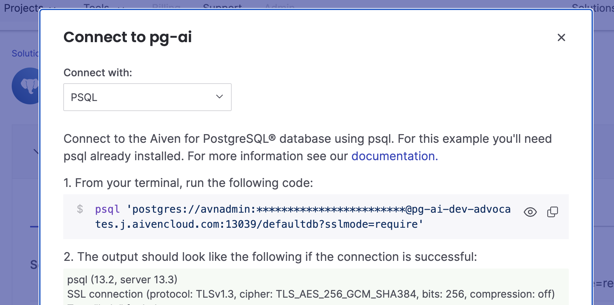

# SQL optimization for beginners

## Part 1. Set up the playground


### Prepare dev environment
We'll be using GitHub Codespaces to simplify the setup of our playground and ensure that we have all tools in place.
[](
https://github.com/codespaces/new/Aiven-Labs/workshop-sql-optimization)

Install psql with
```bash
sudo apt update
sudo apt install postgresql-client
```

### Set up a Postgres database
We'll use Aiven for Postgres for an easy cloud-based solution. Follow [this link](https://go.aiven.io/signup-sql-opt-101) to get extra credits.



Connect to Postgres with psql

```bash
psql 'postgres://[USERNAME]:[PASSWORD]@[HOSTNAME]:[PORT]/[DATABASENAME]?sslmode=require'
```

## Part 2. Detecting query problems

Enable settings:
```sql
\timing on
\pset pager off
\pset linestyle unicode
\pset border 2
\set PROMPT1 '> '
\set PROMPT2 '' 
```

### EXPLAIN and ANALYZE. Read the query plan

Create a simple test table and populate it with numbers: 

```sql
CREATE TABLE sales (
    transaction_id SERIAL PRIMARY KEY,
    amount NUMERIC
);

INSERT INTO sales (amount)
SELECT RANDOM() * 1000 -- Generates random amounts between 0 and 1000
FROM generate_series(1, 1000000); -- Inserting 1 million rows
```

Compare:
```sql
EXPLAIN 
SELECT * from sales LIMIT 10;
```

and
```sql
EXPLAIN ANALYZE 
SELECT * from sales LIMIT 10;
```

Let's make the analyzed result a bit more interesting. Run this query:

```sql
EXPLAIN ANALYZE
SELECT *
FROM (
    SELECT *
    FROM sales
    LIMIT 100000
) AS sales_subset
ORDER BY sqrt(amount);
```

We can make EXPLAIN more verbose:
```sql 
EXPLAIN (analyze, verbose, costs, timing, buffers)
SELECT *
FROM (
    SELECT *
    FROM sales
    LIMIT 100000
) AS sales_subset
ORDER BY sqrt(amount);
```

Documentation link: https://www.postgresql.org/docs/current/sql-explain.html

## Part 3. Understand indexes

### Add an index on a column with unique values:

Create a table with pet preferences and insert test data for four groups of people:

```sql
CREATE TABLE pet_preference (
    person_id SERIAL,
    animal TEXT
);

INSERT INTO pet_preference (animal)
SELECT 'cat'
FROM generate_series(1, 2500000);

INSERT INTO pet_preference (animal)
SELECT 'dog'
FROM generate_series(1, 2500000);

INSERT INTO pet_preference (animal)
SELECT 'axolotl'
FROM generate_series(1, 5000);

INSERT INTO pet_preference (animal)
SELECT 'alpaca'
FROM generate_series(1, 1);
```

Run a sample query to see what pet a person with id = 2 prefers:
```sql
SELECT *
FROM pet_preference
WHERE person_id = 2;
```

Analyze the query and its bottlenecks:
```sql
EXPLAIN ANALYZE
SELECT *
FROM pet_preference
WHERE person_id = 2;
```

Create an index for column `person_id`
```sql
CREATE INDEX idx_id ON pet_preference (person_id);
```

Reference to documentation - https://www.postgresql.org/docs/current/indexes-intro.html

Let's see if that brought us improvements:
```sql
EXPLAIN ANALYZE
SELECT *
FROM pet_preference
WHERE person_id = 2;
```

See information about the index:
```sql
\di+
```

Compare to information about the table:
```sql
\dt+
```

What do you observe about the size of the index vs the table?
What drawbacks of having a big index you can think of?

### Add an index on a column with repeatable values:

Add another index. This time on the pet field:

```sql
CREATE INDEX idx_animal ON pet_preference (animal);
```

Run the queries, does the planner use an index? Why or why not? What do you think?
```sql
EXPLAIN ANALYZE
SELECT *
FROM pet_preference
WHERE animal = 'cat' OR animal = 'dog';

EXPLAIN ANALYZE
SELECT count(*)
FROM pet_preference
WHERE animal = 'cat' OR animal = 'dog';
```

```sql
EXPLAIN ANALYZE
SELECT count(*)
FROM pet_preference
WHERE animal NOT IN ('cat', 'dog');

```
### Add a partial index

Create an index for less frequent values:
```sql
CREATE INDEX idx_rare_animals ON pet_preference (animal)
WHERE animal NOT IN ('cat', 'dog');
```
Observe how its size differs from full index for the same column:

```sql
\dt+
\di+
```

Documentation link: https://www.postgresql.org/docs/current/indexes-partial.html

### Do index only scans when possible

Compare: 
```sql
EXPLAIN ANALYZE 
SELECT * FROM pet_preference 
WHERE person_id = 9;

EXPLAIN ANALYZE 
SELECT person_id FROM pet_preference 
WHERE person_id = 9;
```

Documentation: https://www.postgresql.org/docs/current/indexes-index-only-scans.html

### Index foreign keys

Create two tables. One for pet owners and another for their pets, insert test data:

```sql
CREATE TABLE pet_owners (
    owner_id SERIAL PRIMARY KEY,
    owner_name VARCHAR
);

CREATE TABLE pets (
    pet_id SERIAL NOT NULL,
    owner_id INTEGER,
    pet VARCHAR,
    CONSTRAINT fk_pets FOREIGN KEY (owner_id)
    REFERENCES pet_owners (owner_id)
    MATCH SIMPLE ON UPDATE CASCADE ON DELETE CASCADE
);

WITH owner_rws AS (
    INSERT INTO pet_owners (owner_name)
    SELECT generate_series(1, 1000000) t
    RETURNING owner_id
)
INSERT INTO pets (pet_id, owner_id, pet)
SELECT
    generate_series(1, 4) pet_id,
    owner_id,
    (ARRAY['cats', 'dogs', 'rats', 'unicorns'])[floor(random() * 4 + 1)]
FROM owner_rws;
```

Look for pets of the owner with id=12 by joining two tables:
```sql
SELECT *
FROM pet_owners po
JOIN pets p ON po.owner_id = p.owner_id
WHERE po.owner_id = 12;
```

Create an index and run same request again:
```sql
CREATE INDEX idx_owner ON pets (owner_id);

SELECT * 
FROM pet_owners po
JOIN pets p ON po.owner_id = p.owner_id
WHERE po.owner_id = 13;
```
Observe the decrease of time.


### Find missing indexes

```sql
SELECT schemaname, relname, seq_scan, seq_tup_read, seq_scan 
AS avg, idx_scan
FROM pg_stat_user_tables
WHERE seq_scan > 0
order by seq_tup_read DESC;
```

### Finding useless indexes

```sql
SELECT schemaname, relname, indexrelname, idx_scan, pg_size_pretty (pg_relation_size (indexrelid)) 
AS idx_size 
FROM
pg_stat_user_indexes;
```

## Part 4. Vacuuming and reusing space

```sql
CREATE TABLE pet_count (
    owner_id SERIAL PRIMARY KEY,
    number_of_pets INTEGER NOT NULL
);

INSERT INTO pet_count (number_of_pets)
SELECT 1
FROM generate_series(1, 1000000);
```

```sql
SELECT pg_size_pretty(pg_relation_size('pet_count'));
UPDATE pet_count SET number_of_pets = number_of_pets + 1;
```

When to beware of index bloat (aka when to REINDEX):

```sql
CREATE EXTENSION pgstattuple;
SELECT pg_size_pretty(pg_relation_size('pet_preference')) as table_size, 
       pg_size_pretty(pg_relation_size('idx_id')) as index_size,
       (pgstattuple('pet_preference')).dead_tuple_percent;

-- No Bloat, lets Delete a 3rd of the rows...
DELETE FROM pet_preference WHERE person_id % 3 = 0;

-- Update Stats
ANALYZE pet_preference;

-- Check Bloat
SELECT pg_size_pretty(pg_relation_size('pet_preference')) as table_size, 
       pg_size_pretty(pg_relation_size('idx_id')) as index_size,
       (pgstattuple('pet_preference')).dead_tuple_percent;

SELECT pg_relation_size('pet_preference') as table_size, 
       pg_relation_size('idx_id') as index_size,
       100-(pgstatindex('idx_id')).avg_leaf_density as bloat_ratio;

-- Cleanup
VACUUM ANALYZE pet_preference ;

SELECT pg_size_pretty(pg_relation_size('pet_preference')) as table_size, 
       pg_size_pretty(pg_relation_size('idx_id')) as index_size,
       (pgstattuple('pet_preference')).dead_tuple_percent;

-- Check Again
SELECT pg_relation_size('pet_preference') as table_size, 
       pg_relation_size('idx_id') as index_size,
       100-(pgstatindex('idx_id')).avg_leaf_density as bloat_ratio;
```


